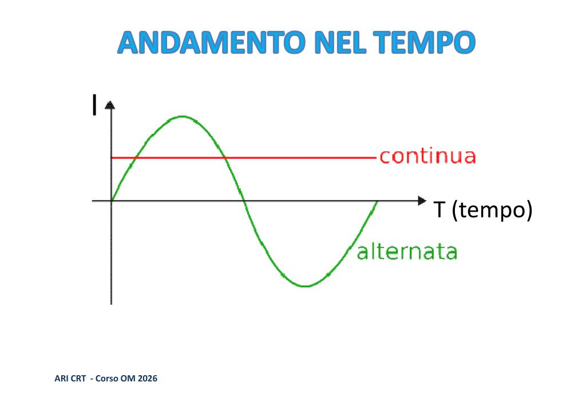
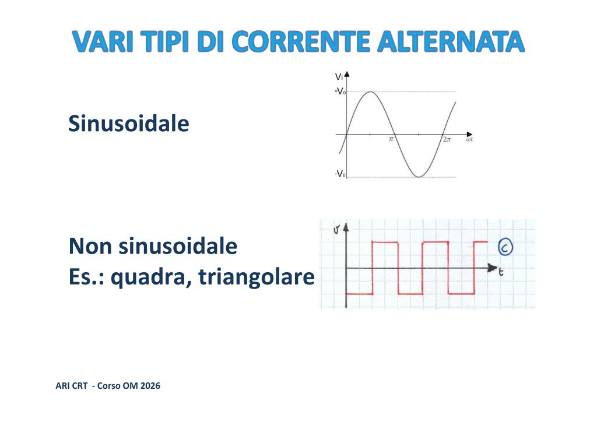
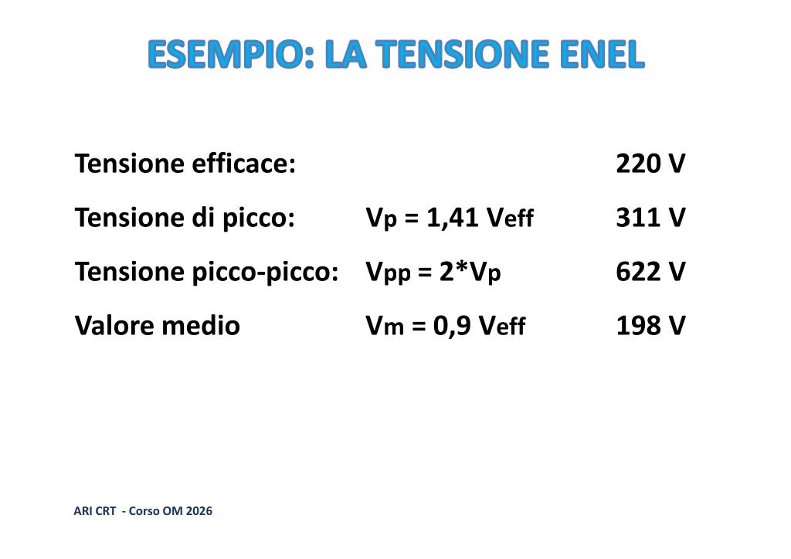
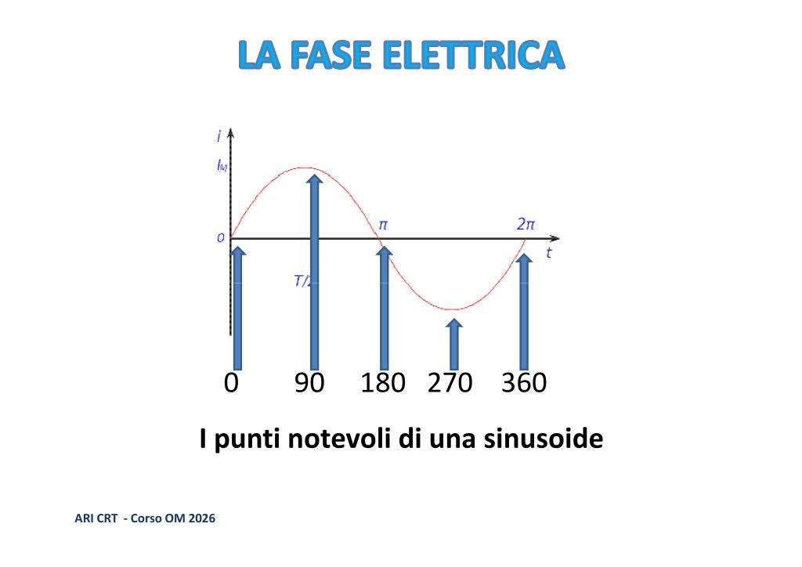
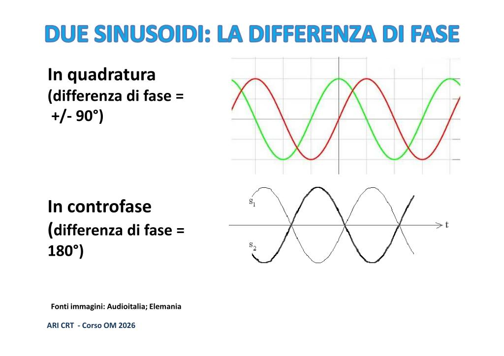
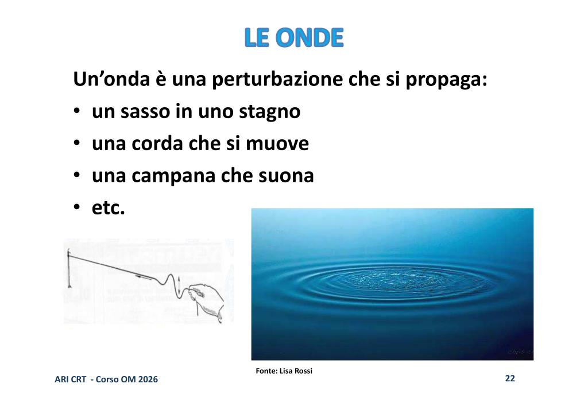
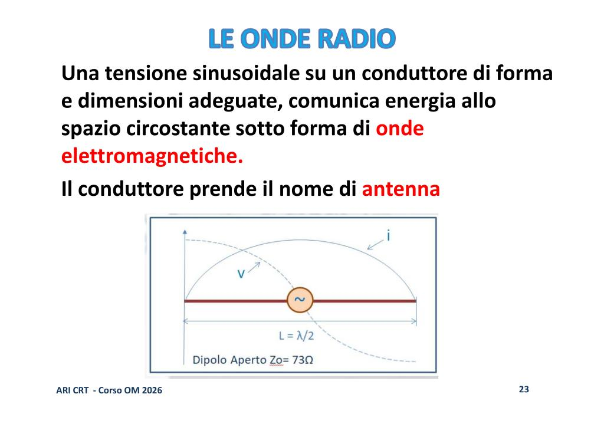
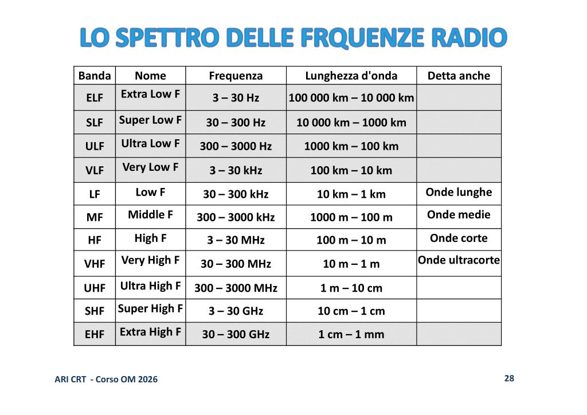

# 📘 Lezione 03 - Circuiti Elettrici e Onde Radio

## 📌 Panoramica

- **Materia e argomento**: Elettrotecnica e Onde Radio — la corrente alternata: sinusoide, frequenza, periodo, valori caratteristici della tensione alternata, fase. Onde elettromagnetiche, lunghezza d'onda, frequenza, bande.
- **Tempo di studio stimato**: 90–120 minuti
- **Prerequisiti**: Aver studiato le Lezioni 01 e 02 sulla corrente continua.
- **Obiettivi di apprendimento**:
  - Comprendere la differenza tra corrente continua e corrente alternata
  - Conoscere il concetto di sinusoide e i suoi parametri
  - Padroneggiare le grandezze frequenza e periodo e la relazione $f = \frac{1}{T}$
  - Distinguere i diversi modi di esprimere il valore di una tensione alternata: istantanea, efficace, di picco, picco-picco, valor medio
  - Comprendere il concetto di fase, controfase e quadratura tra sinusoidi
  - Comprendere cos'è un'onda radio e un'antenna
  - Applicare la formula per calcolare la lunghezza d'onda ($\lambda = \frac{300}{f}$) e la frequenza
  - Conoscere la suddivisione delle frequenze in bande (LF, MF, HF, VHF, UHF, ecc.)

---

## 📖 Contenuti Teorici

## ⚡ 1. La corrente alternata

La **corrente continua** (CC o DC) è un flusso di cariche elettriche (elettroni) che scorre sempre nello stesso verso, dal polo negativo al polo positivo di un generatore (pila, batteria).

La **corrente alternata** (CA o AC) è una corrente che **inverte il senso di scorrimento** un certo numero di volte nell'unità di tempo. Il generatore non ha un polo fisso positivo e uno fisso negativo.

La corrente alternata è generata da una **tensione alternata** ed è prodotta da dispositivi chiamati **alternatori**.
> 💡 **Nota per i neofiti:** Immaginate un magnete che ruota all'interno di una bobina di filo di rame. Un giro completo del magnete (360°) produce esattamente un ciclo completo della sinusoide. Ecco perché la frequenza è spesso intuitivamente associata ai "giri al secondo".

  

 

### 🔹 L'andamento sinusoidale e non sinusoidale

La **corrente alternata sinusoidale** ha una forma "sinuosa": parte da zero, sale a un picco massimo, scende con continuità fino a un minimo (negativo), poi risale.

Esistono anche forme d'onda **non sinusoidali**, come l'onda quadra o l'onda triangolare, ma le sinusoidi sono fondamentali in ambito radio.

  

 

---

## 📈 2. Frequenza e periodo

### 🔹 Frequenza

La **frequenza** — simbolo $f$ — è il numero di cicli completi che un'onda compie in un secondo. Si misura in **hertz** (Hz).

### 🔹 Periodo

Il **periodo** — simbolo $T$ — è il tempo necessario perché la sinusoide compia un ciclo completo. Si misura in **secondi** (s).

### 🔹 Relazione tra frequenza e periodo

Frequenza e periodo sono **l'inverso** l'uno dell'altro:

$$f = \frac{1}{T} \qquad\qquad T = \frac{1}{f}$$

---

## 📊 3. I valori della tensione alternata

Con la corrente alternata, dato che la tensione varia continuamente, servono **più parametri** per descriverla:

1. **Tensione istantanea**: il valore in un preciso istante di tempo.
2. **Tensione efficace (RMS)**: il valore che, applicato a un carico, produce lo **stesso lavoro** di una tensione continua equivalente. Matematicamente si calcola come: $V_{eff} = \frac{V_p}{\sqrt{2}} \approx 0{,}707 \times V_p$.
> 💡 **Esempio Pratico:** Quando diciamo che la tensione della presa di casa è "230V", stiamo parlando del valore *efficace*. In realtà, la tensione di *picco* raggiunge circa i 325V!

3. **Tensione di picco ($V_p$)**: il valore massimo raggiunto dalla sinusoide. $V_p = 1{,}41 \times V_{eff}$
4. **Tensione picco-picco ($V_{pp}$)**: l'escursione totale, dal minimo al massimo. $V_{pp} = 2 \times V_p$
5. **Valor medio ($V_m$)**: media in un semiperiodo. $V_m = 0{,}9 \times V_{eff}$

  

 

---

## 🔄 4. La fase tra sinusoidi

Ogni punto del ciclo di una sinusoide può essere identificato con un **angolo in gradi**.
> 💡 **Analogia della Pista di Atletica:** Immagina due corridori che fanno giri continui su una pista di atletica. Se partono insieme e corrono alla stessa velocità, sono "in fase" (0° di distanza). Se uno parte quando l'altro è esattamente a metà pista (mezzo giro di ritardo, ovvero 180°), sono in "controfase". Se uno ha un quarto di giro di vantaggio (90°), sono "in quadratura".

  

 

- **In fase**: raggiungono simultaneamente picchi e zeri. Sfasamento = 0°.
- **In controfase**: sfasamento di **180°**. Se si sommano, si annullano.
- **In quadratura**: sfasamento di **90°**.

  

 

---

## 📡 5. Onde Radio e Propagazione

### 🔹 Cos'è un'onda radio

Un'onda è una perturbazione che si propaga nello spazio (come un sasso in uno stagno).

  

 

Una tensione sinusoidale su un conduttore di forma e dimensioni adeguate, comunica energia allo spazio circostante sotto forma di **onde elettromagnetiche**. Questo conduttore è l'**antenna**.

  

 

### 🔹 Lunghezza d'onda e Frequenza

La **lunghezza d'onda ($\lambda$)** è la distanza fisica fra due punti omologhi dell'onda elettromagnetica. Dipende dalla velocità di propagazione (la velocità della luce: 300.000 km/s nel vuoto).

$$\lambda = \frac{300.000}{F\text{ (in kHz)}} = \frac{300}{F\text{ (in MHz)}}$$

Esempio:
Frequenza = 14,200 MHz $\rightarrow \lambda = \frac{300}{14,2} = 21,12$ m.

### 🔹 Bande di Frequenza

Le frequenze radio sono suddivise in **bande**: LF, MF, HF, VHF, UHF, ecc. 
Ad esempio, le **HF** (High Frequency) vanno da 3 a 30 MHz (onde corte), le **VHF** (Very High Frequency) da 30 a 300 MHz (onde ultracorte).

  

 

---

## 📝 Punti Chiave

1. La **corrente alternata** inverte periodicamente il senso di scorrimento.
2. **Frequenza** ($f$) e **periodo** ($T$) sono inversamente proporzionali: $f = 1/T$.
3. I valori della tensione alternata includono: **efficace** (usato nei calcoli pratici), **di picco**, e **picco-picco**.
4. Due segnali possono avere una **differenza di fase** (in fase, quadratura, controfase).
5. Un'antenna trasforma la corrente alternata in **onde elettromagnetiche**.
6. La **lunghezza d'onda** ($\lambda$) e la **frequenza** ($f$) sono legate dalla velocità della luce: $\lambda = 300 / f$ (con f in MHz).
7. Lo spettro radio è suddiviso in bande (MF, HF, VHF, UHF, ecc.).

---

## 📝 Quiz di Verifica

<b>1. Se una radio trasmette a 144 MHz, qual è la lunghezza d'onda approssimativa?</b>

Circa 2 metri. (Applica la formula $\lambda = 300 / 144 \approx 2{,}08$ m).

<b>2. La tensione di rete è 230V (efficaci). Qual è la tensione di picco approssimativa?</b>

Circa 325V ($230 \times 1{,}41$).

<b>3. Se due segnali sono sfasati di 180° e hanno la stessa ampiezza, cosa succede se vengono sommati?</b>

Si annullano a vicenda (sono in controfase, quindi quando uno è al suo picco positivo, l'altro è al suo picco negativo).

---

## 📅 Informazioni Lezione

- **Numero Lezione**: 03
- **Data**: 01/04/2026
- **Keywords**: corrente alternata, sinusoide, frequenza, periodo, hertz, tensione efficace, fase, onde radio, lunghezza d'onda, bande HF VHF UHF, antenna.

