# 📘 Lezione 12 - Amplificatori, Oscillatori e Porte Logiche

## 📌 Panoramica

- **Materia**: Radiotecnica — Amplificatori, Oscillatori e Porte Logiche
- **Tempo di studio stimato**: 2 ore
- **Prerequisiti**: Semiconduttori, transistor, valvole (Lezioni precedenti).
- **Obiettivi di apprendimento**:
  - Comprendere la differenza tra amplificatori Audio e RF.
  - Conoscere i concetti di amplificazione di tensione, potenza e rendimento.
  - Distinguere le classi di funzionamento degli amplificatori (A, B, C, AB).
  - Capire il funzionamento degli oscillatori (LC, VFO, Quarzo, PLL).
  - Conoscere la differenza tra segnali analogici e digitali.
  - Familiarizzare con le porte logiche di base (NOT, AND, OR, NAND).

---

## 📖 Contenuti della Lezione

### 1. Amplificatori (Audio e RF)

Un amplificatore ha lo scopo di aumentare l'ampiezza (in tensione o in potenza) di un segnale in ingresso. Nel mondo della radiotecnica, si dividono principalmente in due categorie:

- **Amplificatori Audio (AF)**: Amplificano i segnali a frequenza audio. Non vi sono di norma circuiti risonanti e hanno sempre elementi attivi (transistor, FET, ecc.).
  
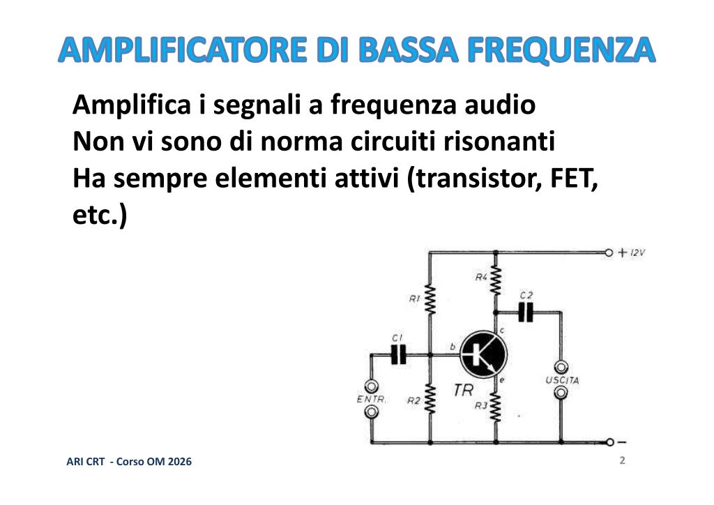
 
- **Amplificatori a Radiofrequenza (RF)**: Amplificano i segnali a radiofrequenza. Vi sono spesso circuiti risonanti, che rendono il circuito selettivo, permettendo di amplificare solo la banda di frequenza desiderata.
  
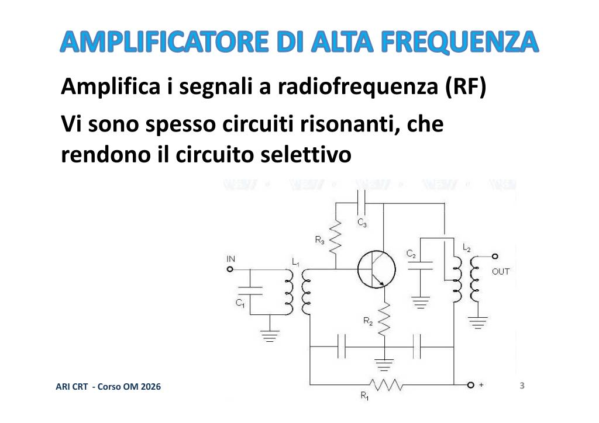
 
  
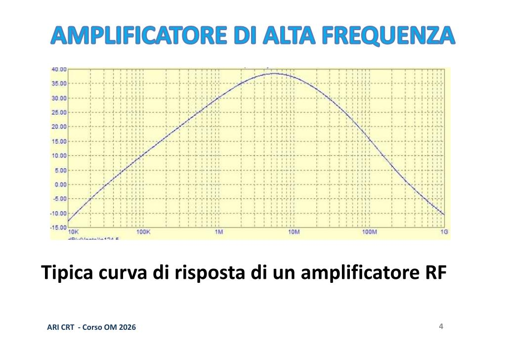
 

**Guadagno e Rendimento**
- L'**amplificazione in potenza** è il rapporto fra potenza in uscita e potenza in ingresso.
- L'**amplificazione in tensione** è il rapporto fra tensione in uscita e tensione in ingresso.
- Il fattore di amplificazione è spesso chiamato guadagno e si esprime di norma in decibel (dB).
  

 
- Il **rendimento ($\eta$)** è il rapporto, espresso in percentuale, fra la potenza in uscita e la potenza assorbita dall'alimentazione: $\eta = P_{OUT} / P_{ALIM}$.
  

 

### 2. Classi di Amplificazione

Gli amplificatori sono classificati in base al punto di lavoro e alla porzione di segnale in ingresso per cui il dispositivo conduce corrente. Le principali classi sono: A, B, C e AB.

 

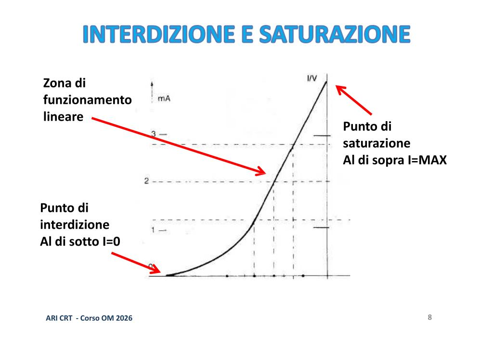
 

**Classe A**
Nella classe A, la corrente scorre per tutto il ciclo del segnale in ingresso (360° elettrici).
- L'amplificazione è molto lineare (il segnale in uscita è identico a quello in ingresso).
- Il rendimento è molto basso (max 20-25%).
- Il punto di lavoro è situato al centro della zona lineare.

 

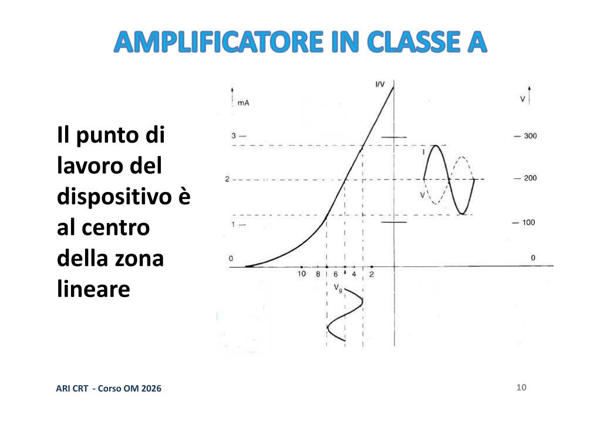
 

**Classe B e Push-Pull**
Nella classe B, la corrente scorre per metà del ciclo del segnale in ingresso (180° elettrici).
- L'amplificazione è distorta se usata con un solo dispositivo.
- Il rendimento è più alto della classe A (intorno al 60%).
- Il punto di lavoro è vicino al punto di interdizione.

 

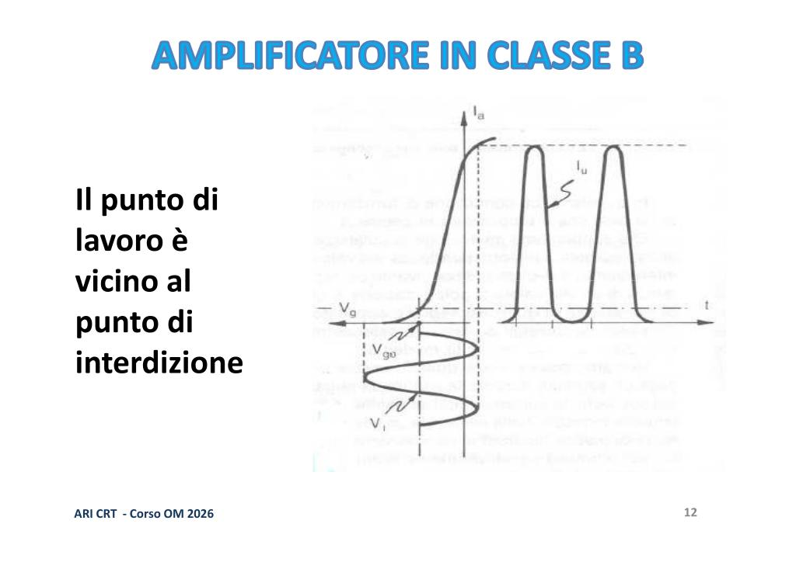
 

Per ridurre la distorsione, la classe B è quasi sempre utilizzata in configurazione **Push-Pull**:
- È composto da due dispositivi attivi. Ogni dispositivo lavora in classe B ed amplifica metà ciclo del segnale (push = spingi, pull = tira).
- La fedeltà di riproduzione è buona con un alto rendimento.

 

**Classe C**
La corrente scorre per meno di 180° del ciclo del segnale in ingresso.
- L'amplificazione è molto distorta, ma il circuito risonante di uscita (LC) ricostruisce la sinusoide completa (effetto volano).
- Il rendimento è molto elevato (70% ed oltre).
- È adatta per segnali che non richiedono linearità di ampiezza (es. CW, FM).
- Il punto di lavoro è ben oltre il punto di interdizione.

 

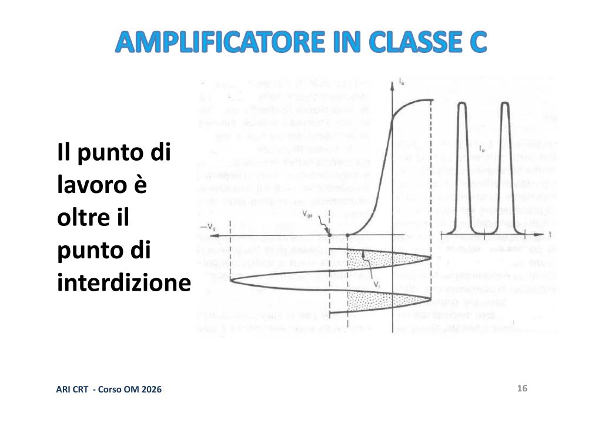
 

**Classe AB**
Una via di mezzo fra A e B, in cui la corrente scorre per un angolo di poco superiore a 180°. L'amplificazione è abbastanza lineare, e il rendimento si attesta al 60-65%.

 

### 3. Oscillatori

Un oscillatore è un circuito che **genera** un segnale a radiofrequenza o a bassa frequenza. Funziona riportando una parte del segnale di uscita all'ingresso (retroazione positiva). Se nel percorso di retroazione è presente un circuito LC o un quarzo, l'oscillatore funzionerà a quella specifica frequenza di risonanza.

 

- **VFO (Variable Frequency Oscillator)**: Rendendo variabile il condensatore di un circuito LC, l'oscillatore può variare la sua frequenza. Sono però poco stabili e tendono a subire derive termiche.
  
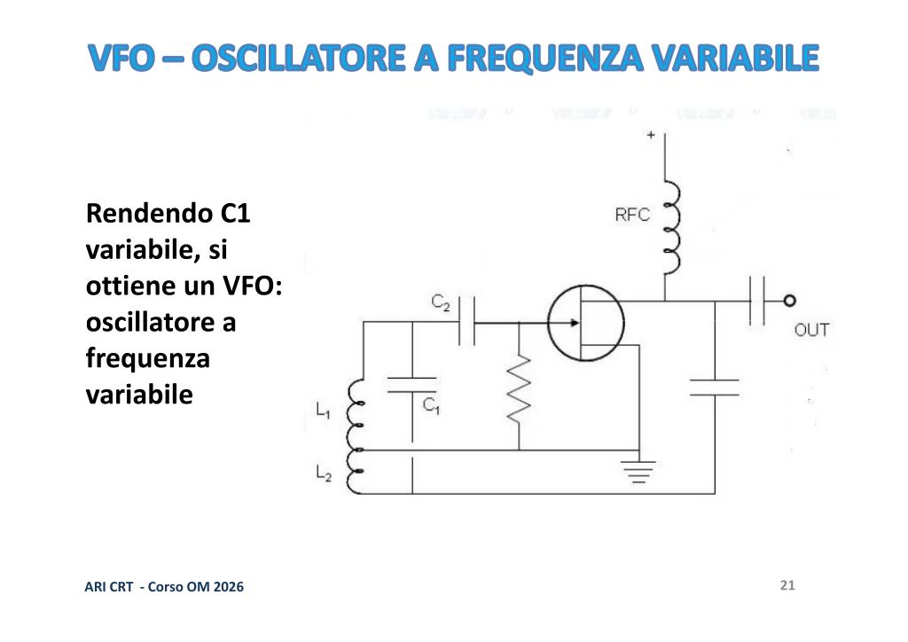
 
- **Oscillatori al quarzo**: Sostituendo il circuito LC con un cristallo di quarzo, la stabilità aumenta enormemente. Si possono generare anche frequenze superiori usando le "armoniche" (tecnica Overtone).
  

 
- **PLL (Phase Locked Loop)**: Serve a generare un segnale di frequenza variabile (come un VFO), ma con l'altissima stabilità di un quarzo. Usa un oscillatore controllato in tensione (VCO) agganciato in fase a un oscillatore di riferimento a quarzo.
  

 

### 4. Porte Logiche e Segnali Digitali

**Analogico vs Digitale**
- I segnali analogici variano la loro ampiezza con continuità tra un valore minimo e uno massimo (es. l'audio).
- I segnali digitali possono assumere solo stati definiti (tipicamente due stati: alto "1" e basso "0").

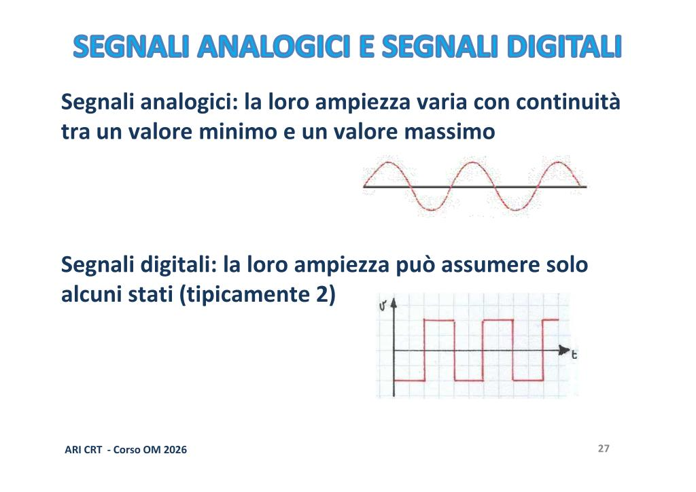
 

Nei circuiti TTL, il livello "0" corrisponde a circa 0.5V e il livello "1" a circa 4.5V. I circuiti logici sono impiegati ovunque nelle radio moderne, ad esempio nei display digitali della sintonia o nei microprocessori di gestione.

**Porte Logiche**
Sono i "mattoncini" fondamentali dell'elettronica digitale. In base a segnali logici in ingresso, forniscono un'uscita secondo una "Tavola della verità".

 

- **NOT**: Inverte il segnale in ingresso. (0 -> 1; 1 -> 0).
  
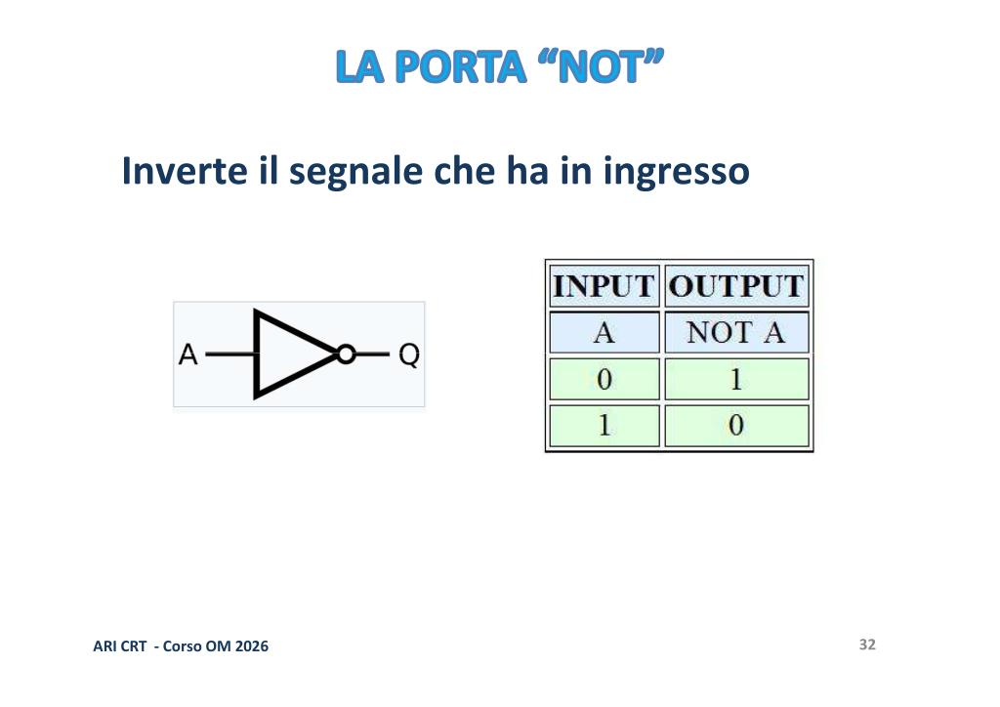
 
- **OR**: Produce un livello logico '1' in uscita se *almeno uno* degli ingressi è '1'.
  
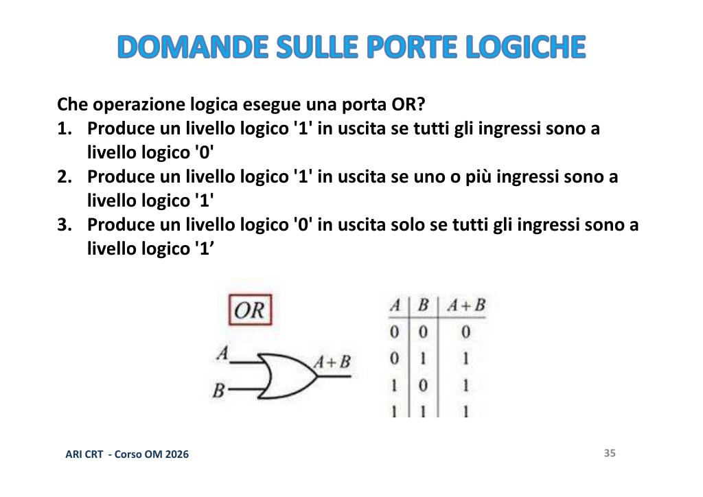
 
- **AND**: Produce un livello logico '1' in uscita *solo se tutti* gli ingressi sono a '1'.
  
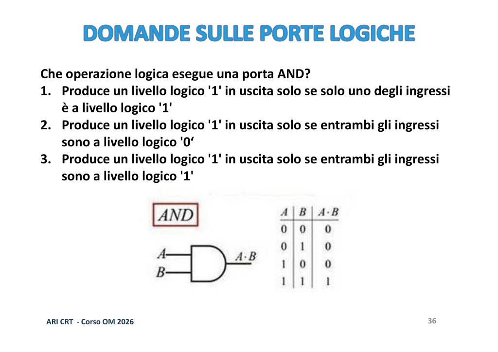
 
- **NAND**: L'inverso della porta AND. Produce un livello logico '0' in uscita solo se tutti gli ingressi sono a '1'.
  
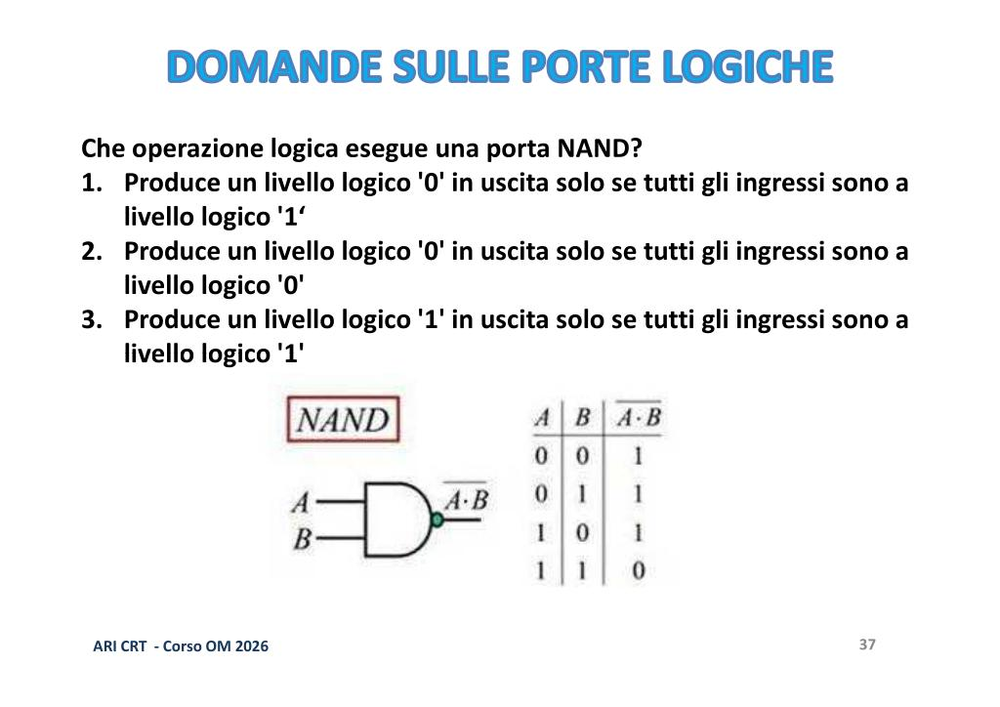
 

---

## ❓ Domande di Comprensione

1. Qual è la differenza principale tra un amplificatore operante in classe A e uno in classe C in termini di linearità e rendimento?
2. Perché è utile utilizzare la configurazione push-pull in un amplificatore in classe B?
3. In cosa differisce un VFO da un oscillatore al quarzo, e qual è il vantaggio di utilizzare un sistema PLL?
4. Qual è l'uscita logica di una porta OR se entrambi i suoi ingressi sono a 0? E se uno degli ingressi è a 1?
5. Spiega la differenza fondamentale tra segnali analogici e digitali in un ricetrasmettitore.

---

## 📚 Glossario

- **Amplificatore Audio (AF)** — Amplificatore per le frequenze udibili dall'orecchio umano.
- **Amplificatore RF** — Amplificatore per radiofrequenze, spesso dotato di filtri e circuiti LC per la selettività.
- **Classe A** — Classe di amplificazione ad alta linearità ma basso rendimento.
- **Classe B** — Classe di amplificazione dove il segnale conduce solo per metà ciclo. Spesso usata in push-pull.
- **Classe C** — Classe di amplificazione non lineare, adatta a segnali FM/CW, con rendimento altissimo.
- **Guadagno** — Il fattore moltiplicativo di un amplificatore, espresso tipicamente in decibel (dB).
- **Oscillatore** — Circuito che genera un segnale RF o AF tramite retroazione positiva.
- **PLL (Phase Locked Loop)** — Sistema che permette di generare frequenze variabili stabilizzate tramite un oscillatore al quarzo.
- **Porta AND** — Porta logica in cui l'uscita è 1 solo se tutti gli ingressi sono 1.
- **Porta OR** — Porta logica in cui l'uscita è 1 se almeno un ingresso è 1.
- **Porta NOT** — Invertitore logico.
- **Push-pull** — Configurazione a due dispositivi attivi che amplificano ciascuno una mezza sinusoide (classe B).
- **Rendimento** — Rapporto percentuale tra la potenza erogata al carico e quella assorbita dall'alimentazione.
- **VFO (Variable Frequency Oscillator)** — Oscillatore a frequenza variabile.

---

## 👥 Partecipanti

- 👨‍🏫 **Relatore principale**: Paolo (Radiotecnica — Amplificatori, Oscillatori, Porte Logiche)
- 👨‍🏫 **Relatore**: Silvio IZ5DIY (Correzioni e coordinamento)
- 👨‍🏫 **Interventi**: Fabrizio (Coordinamento)

---

## 📅 Informazioni Lezione

| Campo                | Valore                                                                                                                                                                                                                                                                 |
| -------------------- | ---------------------------------------------------------------------------------------------------------------------------------------------------------------------------------------------------------------------------------------------------------------------- |
| **Numero lezione**   | 12                                                                                                                                                                                                                                                                     |
| **Data**             | 3 Giugno 2026                                                                                                                                                                                                                                                         |
| **Durata**           | ~2 ore                                                                                                                                                                                                                                                                 |
| **Numero argomenti** | 4 (Amplificatori, Classi di amplificazione, Oscillatori, Porte Logiche)                                                                                                                                                                                                |
| **Parole chiave**    | Amplificatore, classe A, classe B, classe C, push-pull, rendimento, oscillatore, VFO, PLL, quarzo, analogico, digitale, porta AND, porta OR, porta NOT                                                                                                                |
